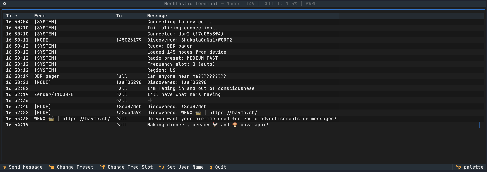

# Meshtastic Scripts

A collection of scripts for playing with Meshtastic devices. These scripts allow you to monitor chat messages, broadcast messages with acknowledgment tracking, and interact with Meshtastic mesh networks.



## Scripts

### 1. Meshtastic TUI (`meshtastic_tui.py`)
A modern terminal UI for monitoring Meshtastic messages in real-time with the ability to send messages.

**Features:**
- Real-time message display with timestamps
- Interactive UI using Textual framework
- Node discovery tracking with persistence
- Radio configuration display (preset/region)
- Live node counter in header
- Press 's' to send a message
- Press Ctrl+Q to quit
- Press ESC to cancel message input
- Automatic message history with configurable limits
- Ability to switch radio presets/modes and frequency slots on the fly
- Theme support via CSS

### 2. Broadcast Until Acked (`broadcast_until_acked.py`)
Sends messages to Meshtastic nodes and monitors for acknowledgments. Runs in a loop until an acknowledgment is received. Use sparingly to avoid flooding the network.

**Features:**
- Configurable destination (broadcast or specific node)
- Automatic retry with configurable intervals
- Packet monitoring and acknowledgment tracking
- Detailed logging of send/receive events

## Prerequisites

- Python 3.8 or higher
- A Meshtastic device connected via USB/serial
- [uv](https://github.com/astral-sh/uv) - Fast Python package installer and resolver

## Installation

### 1. Install uv (if not already installed)

On macOS/Linux:
```bash
curl -LsSf https://astral.sh/uv/install.sh | sh
```

Or using Homebrew:
```bash
brew install uv
```

For other installation methods, see [uv documentation](https://github.com/astral-sh/uv).

### 2. Clone or download this repository

```bash
gh repo clone richstokes/meshtastic_scripts
cd meshtastic_scripts
```

### 3. Install dependencies with uv

```bash
uv sync
```

This will:

- Create a virtual environment (if needed)
- Install all required dependencies
- Make the scripts available for execution

## Usage

### Running with uv

The recommended way to run these scripts is using `uv run`:

#### Meshtastic TUI

```bash
uv run python meshtastic_tui.py
```

#### Broadcast Until Acked

```bash
uv run python broadcast_until_acked.py
```

## Contributing

Feel free to submit issues or pull requests to improve these scripts!
